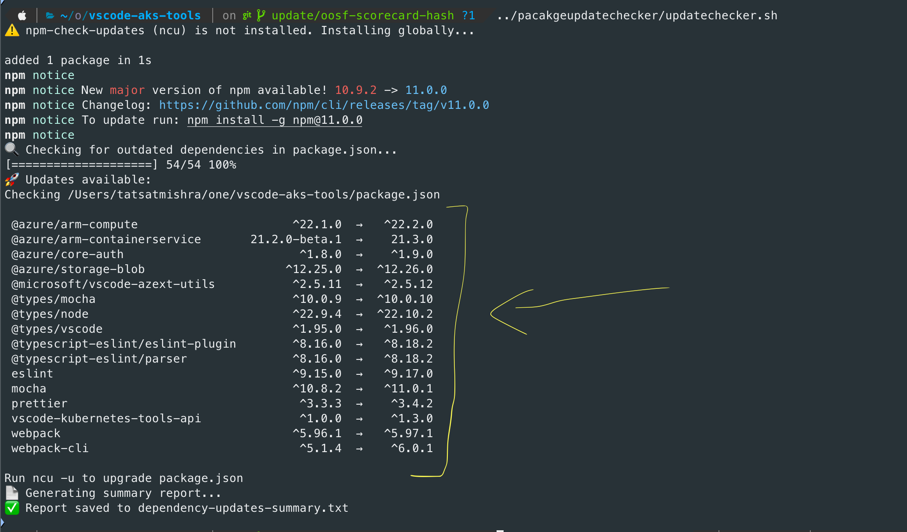

# 🚀 **Dependency Update Checker for TypeScript Projects**

A simple and efficient **Shell Script** to identify outdated dependencies in your **TypeScript project's `package.json`** and generate a summary report.

---

## 📋 **Overview**

This script uses `npm-check-updates (ncu)` to:

- Check for outdated dependencies in your `package.json`.  
- Display available updates in the console.  
- Generate a detailed summary report (`dependency-updates-summary.txt`) with suggested updates.

---

## 🛠️ **Setup**

1. **Clone the Repository:**
   ```bash
   git clone https://github.com/Tatsinnit/ts-dependency-checker.git
   cd ts-dependency-checker
   ```

2. **Make the Script Executable:**
   ```bash
   chmod +x updatechecker.sh
   ```

3. **Run the Script:**
   ```bash
   ./updatechecker.sh
   ```

---

## Screenshot of usage:



---

## 🔑 **Features**

- ✅ **Dependency Check:** Identifies outdated dependencies in your `package.json`.  
- 📊 **Summary Report:** Generates a `dependency-updates-summary.txt` with detailed findings.  
- ⚡ **Quick Installation:** Automatically installs `npm-check-updates` if not already installed.  
- 📦 **Customizable:** Easily extendable for CI/CD workflows.

---

## 📄 **Generated Files**

- **dependency-updates.txt** – Raw output of `ncu`.  
- **dependency-updates-summary.txt** – Human-readable summary of available updates.

---

## 🚀 **Update Dependencies**

After checking for updates, you can easily upgrade dependencies using:
```bash
ncu -u
npm install
```

---

## 🤝 **Contributing**

- Fork the repository.  
- Create a new branch (`git checkout -b feature-branch`).  
- Commit your changes (`git commit -m 'Add some feature'`).  
- Push to the branch (`git push origin feature-branch`).  
- Create a Pull Request.

---

## 📝 **License**

This project is licensed under the **MIT License**.

---

## 📬 **Contact**

- **Author:** Tats

Feel free to report bugs, suggest features, or contribute to improving this script. Happy coding! 🚀✨
